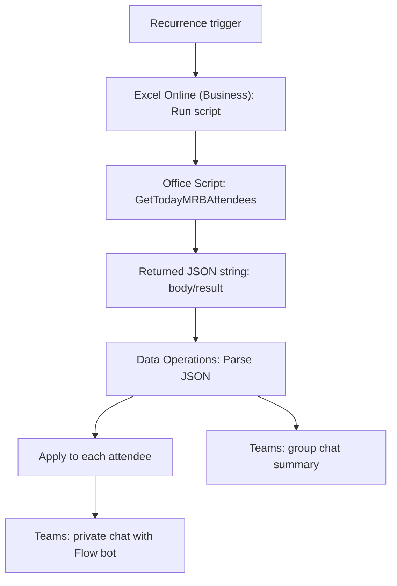

# Architecture

This document explains how the MRB reminder workflow is wired together and how data moves from Excel to Microsoft Teams.

## High-Level Workflow



## Components

| Component | Responsibility |
|---|---|
| `MRB` sheet | Stores the meeting schedule matrix. Dates are on row 3 and `X` marks attendees for each date. |
| `Members` sheet | Stores the private name-to-Teams-email mapping used for direct messages. |
| `GetTodayMRBAttendees` Office Script | Reads the workbook, finds today's meeting column, maps attendee names to emails, and returns JSON. |
| `Parse JSON` | Converts the script's JSON string into fields Power Automate can use. |
| `Apply to each` | Loops through `attendees` and sends one private Teams message per attendee. |
| Final Teams action | Sends one clean summary message to the shared group chat. |

## Excel Data Model

The workflow expects two worksheets.

### `MRB`

- The schedule is read from `B1:AZZ120`.
- Excel row `3` is the date row.
- The script scans the date row from right to left because the schedule grows horizontally.
- The first date cell that matches today's Vietnam date is used.
- The attendee-name column is detected by searching left from today's date column.
- A normalized `X` in today's date column means that row has an MRB meeting.

### `Members`

| Column | Meaning |
|---|---|
| A | Attendee name |
| B | Teams email / UPN |

Names are trimmed, multiple spaces are collapsed, and comparison is case-insensitive. The script does not send a private reminder when a marked attendee has no matching email.

## Script Output Contract

The Office Script returns a JSON string. Power Automate receives it as `body/result`.

```json
{
  "debug": {
    "todayKey": "13-aug",
    "todayColumnName": "QS",
    "nameColumnName": "B",
    "attendeeCount": 2,
    "checkedRange": "B1:AZZ120",
    "missingEmailCount": 0,
    "missingEmails": [],
    "marksFound": []
  },
  "groupMessage": "Nhac lich hop MRB hom nay...",
  "attendees": [
    {
      "name": "Example User",
      "email": "example.user@company.com",
      "group": "CU CHI - MRB MEETING",
      "date": "13-Aug",
      "message": "Hi Example User,..."
    }
  ]
}
```

Power Automate should use these parsed fields:

| Field | Used by |
|---|---|
| `attendees` | `Apply to each` input |
| `attendees[*].email` | Private Teams message recipient |
| `attendees[*].message` | Private Teams message body |
| `groupMessage` | Shared group chat summary |
| `debug` | Troubleshooting only |

## Power Automate Runtime Flow

1. **Recurrence** starts the flow once per day using the configured Vietnam-friendly timezone.
2. **Run script** opens the Excel workbook and executes `GetTodayMRBAttendees`.
3. **Parse JSON** reads `body/result` and exposes `debug`, `groupMessage`, and `attendees`.
4. **Apply to each** loops over `attendees`.
5. Inside the loop, **Post message in a chat or channel** sends:
   - `Recipient`: `Body email`
   - `Message`: `Body message`
6. Outside the loop, a second Teams action sends:
   - `Post in`: `Group chat`
   - `Message`: `Body groupMessage`

## Data Flow

```text
Excel MRB sheet + Members sheet
-> Office Script
-> JSON string returned as body/result
-> Parse JSON object
-> attendees[] for private messages
-> groupMessage for group summary
```

## Common Failure Modes

| Symptom | Likely cause | Fix |
|---|---|---|
| Group chat receives raw JSON | The group Teams action uses `body/result` instead of `Body groupMessage`. | Change message to `body('Parse_JSON')?['groupMessage']`. |
| Duplicate group messages | An older shared flow is still turned on. | Turn off or delete the old flow copy. |
| Private message is skipped | Attendee name is marked with `X` but missing from `Members`. | Add or correct the matching name and email in `Members`. |
| Wrong date or no attendees | The date column was not found in `B1:AZZ120`, or the schedule moved outside the checked range. | Extend `checkedRange` in the script if needed. |
| Dynamic content is missing | Power Automate has stale output metadata. | Save the script, then refresh or recreate the `Run script` / `Parse JSON` actions. |

## Security Boundary

Keep production-only information outside this repository:

- real employee lists and emails;
- real Excel workbooks;
- SharePoint or OneDrive URLs;
- Teams group chat IDs;
- Power Automate connection references;
- exported flow packages with tenant metadata.

This repository should contain source code, schemas, examples, and setup documentation only.
